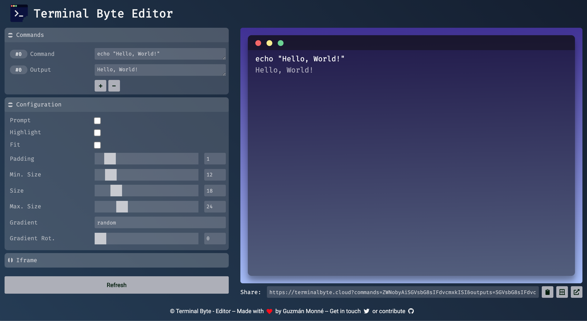

<h1 style="display: flex; align-items: center;">

&nbsp;&nbsp;Terminal Byte - Editor
</h1>

Simple editor that allows the creation of "Terminal bits". You can configure all the settings for each `bit` and then share them using the `link` or embeding them on your own sites through an `iframe`.

## License

BSD-2

## Contribute

We welcome any contribution to the project. Everything is built using `parcel` and powered by `react`. Just `clone` the project run `npm install` or `yarn install` to add your contribution.

## Test

Run `npm test` to run all the tests. This test suit is run through `jest`.

## Author

[Guzmán Monné](htttps://twitter.com/guzmonne)